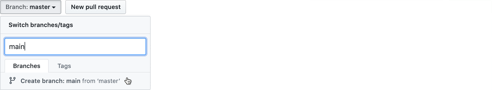

# retarget_prs


This utility will change change the base of all the pull requests in your GitHub repository that are currently targetting a different branch.  This is useful if you want to change the name of your default branch, but you have pull requests open.

For example, if you use the _default_ default branch of `master`, but you want to change that to a name like `main`, by default the pull requests that you already have open in your repository will continue to target the old default branch (`master`).

Fortunately, you can [change the base of an existing pull
request](https://github.blog/2016-08-15-change-the-base-branch-of-a-pull-request/),
but this is a one-at-a-time, manual operation.

This utility will automate that, and make this change en masse.

## Setup

1. Ensure that you have [Node.js](https://nodejs.org/en/download/) installed.
2. Clone this git repository:
   ```
   git clone https://github.com/ethomson/retarget_prs
   ```
3. Install the dependencies:
   ```
   cd retarget_prs
   npm install
   ```

## How to

If you want to change the name of the default branch on GitHub:

1. Go to your project and make sure that you are on the current default
   branch (`master`).  Open the branch picker, and type the name of the new
   branch (`main`).  Select `Create branch: main from 'master'`.

   

2. Set this as the new default branch.  Go to your project's settings, then
   select "Branches".  Under "Default branch", open the branch picker and
   select the new default branch (`main`).

   

3. Update the existing pull requests:

   ```
    node index.js https://github.com/your/repo master main
    ```

## Questions?

Need help?  [Open a GitHub issue](https://github.com/ethomson/retarget_prs).